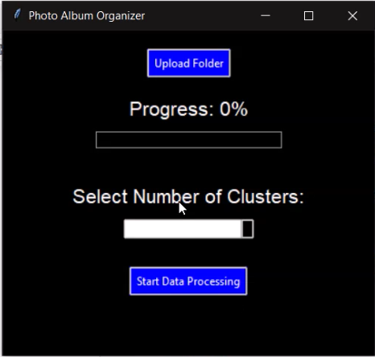
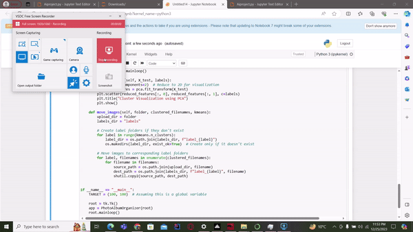
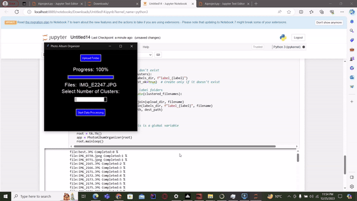

# Photo Album Organizer

## Overview

The Photo Album Organizer is a Python application designed to automate the organization of photo collections. Leveraging the K-Means clustering algorithm, the application categorizes images into clusters based on visual similarities. This README provides instructions on how to run the project and an overview of its functionalities.

## UI 
 

## Features

- **User-Friendly Interface:** The application provides a simple and intuitive graphical user interface using the Tkinter library.
- **K-Means Clustering:** Automatically categorize images into clusters based on user-defined specifications.
- **Result Visualization:** View the clustered results along with a subset of images from each cluster. PCA-based visualization is also provided.
- **Image Movement:** Organize images by moving them into labeled folders based on their assigned clusters.

## Working 



## How to Run the Project

Follow these steps to run the Photo Album Organizer:

1. **Need to install Dependencies**
    - For windows 
    ```bash
    pip install -r requirments.txt    
    ```
    - For Linux 
    ```bash
    pip3 install -r requirments.txt
    ```
    

2. **Run the Application:**
   ```bash
   python photo_organizer.py
   ```

3. **Use the Graphical Interface:**
   - Click the "Upload Folder" button to select the folder containing your images.
   - Set the number of desired clusters using the drop-down menu.
   - Click the "Start Data Processing" button to initiate the clustering process.

4. **View Results:**
   - After processing, a new window will display the clustered results.
   - Explore the clusters and click "Show Results" to view a subset of images from each cluster.

5. **Organized Output:**
   - The application automatically moves images into labeled folders based on their assigned clusters.

## Project Structure

- `photo_organizer.py`: Main script containing the PhotoAlbumOrganizer class and the Tkinter GUI setup.
- `README.md`: Project documentation in markdown.
- `Manual.pdf`: Project documentation in PDF manual.
- `requirements.txt`: List of Python dependencies.
- `images/`: Sample images for testing the application.

## Dependencies

- `tkinter`
- `scikit-learn`
- `numpy`
- `opencv-python`
- `matplotlib`
- `Pillow`

## Additional Notes

- Ensure that you have Python installed on your system.
- The target size for image resizing is set as (100, 100) in the script. You can modify this value based on your preferences.[Photo Organizer](./photo_organizer.py)


Feel free to explore and customize the Photo Album Organizer to suit your needs!